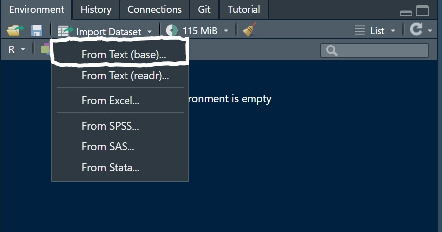
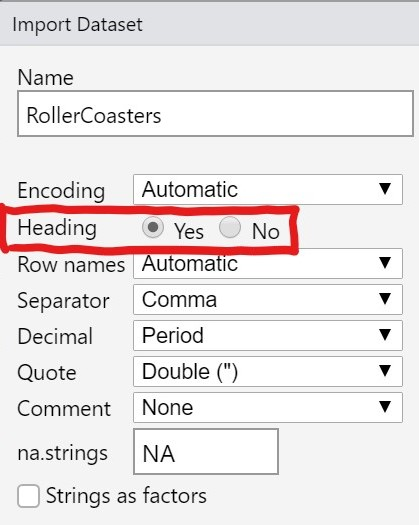
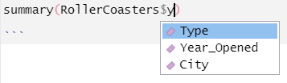
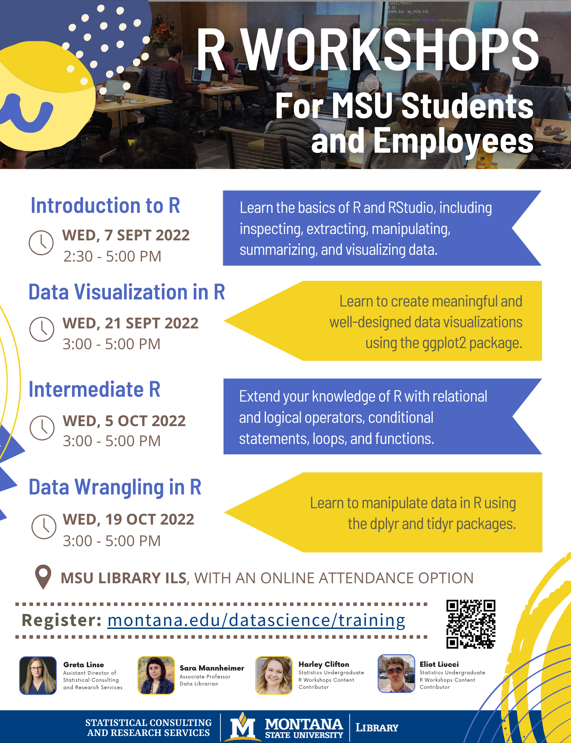

```{r setup, include=FALSE}
#remotes::install_github("rstudio-education/gradethis")
library(remotes)
library(ggplot2)
library(learnr)
library(tidyverse)
library(datasauRus)
library(gridExtra)
library(plotly)
library(catstats)
library(gradethis)
knitr::opts_chunk$set(echo = FALSE, exercise.checker = gradethis::grade_learnr)

# Put any code that needs to be run at beginning of App
RollerCoasters <- read_csv("RollerCoasters.csv")
x <- 7
```

## Getting a Feel for the Class and Your Role

Congratulations on becoming a STAT 216 Teaching Assistant! As you may know from your personal experience if you took STAT 216 at Montana State University, Teaching Assistants can make a world of difference to students.

Some students, especially college freshman, may feel intimidated with contacting a professor directly for help. That's where you come in! Your role as a TA consists of aiding students in gaining a nuanced understanding of introductory statistical methods, giving students real-time feedback, and troubleshooting any coding issues that arise.

A large part of your position is to maintain communication between the students and lead instructors. If you see common issues arising, be sure to communicate this to your lead instructor so they can get everyone on the same page and clear up any misconceptions.

$~$
$~$

### STAT 216 Course Materials

Students will be required to purchase a **Coursepack** which will contain the activities and labs they will work through and complete over the course of the semester. This will be available for them to purchase at the MSU Bookstore.

There is also a **Textbook** for the course. Note: **The course textbook is NOT the same thing as the coursepack!** Many students confuse this, especially early on. Students can access a free copy of the STAT 216 Textbook online. They can find this by going to the [STAT 216 Course page](https://math.montana.edu/courses/s216/) on montana.edu, through a link posted on D2L, or through a link on the [STAT 216 Syllabus](https://mtstateintrostats.github.io/Syllabus/). Here is a direct link to the [Online Textbook](https://mtstateintrostats.github.io/IntroStatTextbook/) as well.

The **activities** and **labs** in the coursepack with often require students to use an R script file to complete. This R Bootcamp is meant to help you get a better understand of coding in R so you can help students when they run into issues.

$~$
$~$

### Other Resources Available

There are a variety of other resources available for STAT 216 students:

1. **Dr. Christopher B. Lofgren Center for Excellence in Mathematics and Statistics (MSC)**

The [Math and Stat Center](https://math.montana.edu/undergrad/msc/) (MSC) is located on the same floor in Romney that the STAT 216 classes are held, so you can't miss it. There are always in-house tutors available that can help students with statistics. Students automatically have access to the MSC through enrolling in STAT 216, and can enter for free by swiping their CatCard. The MSC has the activity solutions so students can check their work and get more in-depth feedback by looking through them.

$~$

2. **SmartyCats Tutoring**

If you aren't already aware, there are [SmartyCats Tutors](https://www.montana.edu/aycss/success/smartycats/) available for a wide variety of MSU classes. The majority of tutors have taken the courses before and have a good idea of the instructors expectations. Tutoring sessions only cost \$2 a piece, which mean they are very affordable for most students.

$~$

3. **Other Tutoring Opportunities**

There are multiple private tutors as well! There is a bulletin board near the Department of Mathematical Sciences Office in Wilson Hall (2nd floor) where student tutors post their contact information. Since Wilson is a maze and finding the bulletin board can be intimating, students can also reach out to the math department through email as well.

If a student is a Veteran or is using a relative's Military Educational Benefits to help pay for school, there are free statistics tutors available to them through the [Veterans Center](https://www.montana.edu/veteran/) on Campus. The Veterans Support Center is also located in Romney, but on the first floor.

------------------------------------------------------------------------

## Introduction to R

>
> Coding can be very intimidating, especially for students with no prior coding experience. Thus, the R script files accompanying activities and labs are heavily scaffolded---requiring minimal alterations by students. Students will be expected to gradually contribute more in R, but are not expected to be expert coders at any point during the course.
>

$~$

### RStudio Layout

R is the programming language that runs computations, while RStudio is the interface in which you engage with R (called an "integrated development environment", or IDE). We often use "R" and "RStudio" interchangeably. In order to get started with R and RStudio, it will be beneficial to first understand the RStudio User Interface. RStudio has the following layout:

-   the **Editor** for your scripts and documents (top-left)\
-   the R **Console** (bottom-left)\
-   your **Environment (Objects/Variables)/History** (top-right)\
-   and your **Files/Plots/Packages/Help/Viewer** (bottom-right).


$~$

### Personalize RStudio Appearance

The color scheme of RStudio can also be changed by going to **Tools --\> Global Options --\> Appearance --\> Editor Theme**. This can make the long days of coding a lot easier on the eyes. 

Another way to personalize RStudio is to change the pane layout. This can be done in **Tools --\> Global Options --\> Pane Layout**.

Font size is another feature that can be altered for aesthetics and accessibility reasons. To change the font size in RStudio, click **Tools** in the upper left panel --\> select **Global Options** --\> choose the fourth option from the top titled **Appearance** --\> change the **editor font size** --\>  click **Apply** to see what the font size will look like --\> once satisfied, select **OK**.

$~$

### Basics of Coding in R

Now that RStudio is personalized to your specifications, we can start diving into the basics of coding with R. R is called an "object-oriented language"---one of the most useful concepts is to store values as an "object". This can be done using an arrow `<-` (called "assignment") as shown below. It is important to note that this only goes one direction.

```{r practice1pt1, exercise = TRUE}
x <- 7
```

We can then check the value of our object by simply typing its name.

```{r practice1pt2, exercise = TRUE}
x
```

We can also use R to do math. This can be combined with objects to do some fun stuff.

```{r practice1pt3, exercise = TRUE}
x + x * x
```

Similarly to how we store values as an object, we can do the same with vectors or even whole data sets! To store a vector as an object, write the vector inside of the concatenate function `c()`, being sure to add commas between separate values and quotations around words, to let R know you have a list of values. Vectors can be letters, numbers, or a combination of the two.

```{r practice1pt4, exercise = TRUE}
My_Vector <- c(1, 2, 'lettuce', 4, 'tomato')

My_Vector
```

Note that if any of the values in the vector are characters, R will store all the values as a character. You can check the type of a vector with the `typeof()` function. Possible types you may encounter include: 'character', 'double' (a real number), 'integer', and 'logical' (TRUE/FALSE).

```{r practice1pt4, exercise = TRUE}
typeof(My_Vector)

typeof(x)
```

To store a dataset in R, we can do something similar. However, we must first import the dataset into the R environment by using a function such as the `read_csv()` from the `tidyverse` package. The code below reads a .csv file (Comma Separated Values) into the environment window in R and stores it as the object `RollerCoasters`.

```{r practice1pt5, exercise = TRUE}
RollerCoasters <- read_csv('RollerCoasters.csv')
```

When this is done, we can see some information show up in the Console. We see how many rows and columns the dataset has as well as the variables and their type. Variables can either be 'double' if they are numbers of 'character' if they are words.

$~$

Each row in this particular dataset holds information for a single roller coaster, and the columns represent:

| Column            | Description                                                                 |
|------------------|------------------------------------------------------|
| Age_Group         | 1:Older (1900-1979), 2:1Recent (1980-1999), 3:Newest (200-Current)          |
| Coaster           | Name of the roller coaster                                                  |
| Park              | Name of the park where the roller coaster is located                        |
| City              | City where the roller coaster is located                                    |
| State             | State where the roller coaster if located                                   |
| Type              | Material of track (Steel or Wooden)                                         |
| Design            | How a passenger is positioned in the roller coaster                         |
| Year_Opened       | Year when the roller coaster opened                                         |
| Top_Speed         | Maximum speed of the roller coaster (mph)                                   |
| Max_Height        | Highest point of the roller coaster (ft)                                    |
| Drop              | Length of largest gap between high and low points of roller coaster (ft)    |
| Length            | Length of the roller coaster track (ft)                                     |
| Duration          | Time length of roller coaster ride (sec)                                    |
| Inversions        | Whether or not the roller coaster flips passengers at any point (Yes or No) |
| Num_of_Inversions | Number of times the roller coaster flips passengers                         |

$~$

### Importing a Dataset using the Drop-Down Menu

If a data set does not already live in the folder where R is operating (called the "working directory"), students will have to upload the dataset .csv file to the server ***using the drop down menu*** before R can read it in like above.

In the Environment tab (top right), click _Import Dataset_ and choose the _From Text (base)_ option.




Select the dataset from where the file is downloaded on your device.
Once you have selected the dataset, another window will appear.
Here, it is critical that you **select YES for Heading** for the dataset to be uploaded correctly and usable
(since all datasets in this course will include a header row of variable names).



After 'Yes' is selected, click 'Import' and you are done! 

If a student claims they imported the dataset but it still is not reading in
correctly for them, walk through this process with them to double check.

$~$

### Viewing the Dataset

Once the dataset is imported into the RStudio Server, it can be viewed by clicking on the **Environment tab** in the upper right corner of the server and double clicking the dataset you want to view. The dataset will be opened as a new tab in the upper left corner of the server, allowing you to see all the variables and how their names are formatted! The formatting of variable names is very important when coding, and often is the source of early mistakes in STAT 216.

If we want to get a summary of only a certain set of rows or columns from a dataset, we can write `[row, column]` after the dataset to get a subset of the data frame. The `View()` function can also be helpful to view the entire dataset by typing the following into the **Console**:    

```{r eval = FALSE, echo = TRUE}
View(RollerCoasters)
```

$~$

```{r practice2, exercise = TRUE}
RollerCoasters[1:5,1:3]
```

The code above is providing rows 1 through 5 and columns 1 through 3 of the `RollerCoasters` dataset.

You can also select individual variables from a dataset using `$`. The code below selects the
`Top_Speed` column from the `RollerCoasters` dataset.

```{r practice2, exercise = TRUE}
RollerCoasters$Top_Speed
```

We can also run functions on vectors, like `mean()` or `summary()`, that allow us to determine key information.

```{r practice3pt1, exercise = TRUE}
mean(RollerCoasters$Top_Speed)

summary(RollerCoasters$Top_Speed)
```

Notice that when you tried to calculate the mean top speed of rollercoasters above,
the result was `NA` (or missing). This is because there are missing values in
the dataset itself---some rollercoasters did not report a top speed. You
can calculate the mean of the non-missing observations by using the argument
`na.rm = TRUE`.

```{r practice3pt1, exercise = TRUE}
mean(RollerCoasters$Top_Speed, na.rm = TRUE)
```

Another important component to R is commenting on code without affecting the code itself.
This can be done by typing a pound symbol `#` before the comment.

```{r practice3pt2, exercise = TRUE}
2 + 2 #Look at how well R can add!
```

Comments do not need to be run for the code to work. If comments are run, they do not effect the output.
However, it is good practice to document your code through comments so others can easily understand it.
Comments can exist on a line alone, after a line with a section of a function, but cannot exist between code on the same line.

$~$

### Now You Try!

#### Exercise 1

**Write code to print out the 5th through 8th rows from the `RollerCoasters` dataset.**

```{r IntroToRExercise1, exercise = TRUE}

```

```{r IntroToRExercise1-solution}
RollerCoasters[5:8, ]
```

```{r IntroToRExercise1-check}
grade_code()
```

------------------------------------------------------------------------

## Navigating the RStudio Server

$~$

### Where to Access it

Students will have multiple modes of accessing the RStudio Server.

- One option is to go through [Montana State University Webpage](https://www.montana.edu/), search "RStudio server", and click the [RStudio Sign In](https://rstudio.math.montana.edu/) link.

- Students will also have a link available to them within the STAT 216 page in D2L.

- The RStudio Server can also be accessed through the [Syllabus](https://mtstateintrostats.github.io/Syllabus/) under Course Materials and Resources --\> RStudio.

Once students are directed to the RStudio Server, they will then be prompted to **Sign in** using their **MSU NetID and password**---this will be the same login information they use to access D2L.

$~$
$~$

### R is Case-Sensitive

You may have heard this if you took STAT 216 at MSU, but what does this really mean?

Essentially, R is very literal and not always good at reading our minds. It matters whether words are capitalized or lowercase when storing or calling a dataset, variables, or functions.

For example, if you are trying to use a variable named "Year" but accidentally type "year" with a lowercase "y", R will not recognize or understand what you are trying to reference.

You can use **Tab-Completion** to reduce issues with case sensitivity. This is where R will suggest auto-complete options when you start typing in a variable name. By selecting one of these options, you are sure to reference something that R will recognize. Here is an example of what this looks like:



$~$
$~$

#### Exercise 2

**Referencing the `RollerCoasters` Dataset, can you find and correct the mistake? (Hint: Remember that R is case-sensitive!)**

```{r ServerExercise2, exercise = TRUE}
summary(rollercoasters)
```

```{r ServerExercise2-solution}
summary(RollerCoasters)
```

```{r ServerExercise2-check}
grade_code()
```

$~$
$~$

### Using Packages

What is a Package in R? According to [TutorialsPoint.com](https://www.tutorialspoint.com/r/r_packages.htm):

>
> "R packages are a collection of R functions, complied code and sample data. They are stored under a directory called _library_ in the R environment. By default, R installs a set of packages during installation. More packages are added later, when they are needed for some specific purpose. When we start the R console, only the default packages are available by default. Other packages which are already installed have to be loaded explicitly to be used by the R program that is going to use them."
>

When working with packages, there are two different steps.

-   First, a package must be installed onto the RStudio server. This step only needs to be done once.

-   Second, you must load the package (using the `library()` function) to use any of the functions in it. This must be done each time a new session in the RStudio server is started.

Here is an analogy that has been extremely helpful when explaining why students must run the `library( )` codes first whenever they open an R script file:


Any package that is used in STAT 216 will already be installed on the RStudio server.
However, if students are running RStudio on their own laptop or a different device,
they first may need to install the package. This can be done by clicking the
"Packages" tab in the lower right, clicking "Install", then searching for the package name.
Packages commonly used in STAT 216 include: `tidyverse` (which is actually a suite
of packages, including `ggplot2` for graphics and `dplyr` for data wrangling),
`openintro`, and `mosaic`.

STAT 216 also has its own R package called `catstats` hosted on 
Github (which means it cannot be installed through the "Packages" tab in R)
We will explore `catstat` later in this tutorial.

$~$
$~$

### Importing and Exporting Files within the Server

Students should be saving their R code in R script files (.R). These script files
will be posted in D2L and will need to be imported into their RStudio session.

$~$

#### Importing Files

In the bottom right corner of the server, select _Upload_ in the _Files_ tab --\> _Choose File_ --\> students should select the file where ever it was saved or download to their device --\> _Select File_ --\> _Open_. 

This should automatically open the file in the top left panel of the server.

$~$

#### Exporting Files

There are two steps when exporting Files from the RStudio Server.

- First, it must be **saved to the server**. To do this, start in the top left section of the server.
Make sure the student is on the tab of the file they want to save.
In that top left section, click _File_ --\> _Save As_ --\> then students will
be prompted to name their file --\> select _Save_.

- Now the file name should appear under the Files tab in the bottom right corner.
Direct students to click the check box next to the file name --\> then
select _More_ --\> click _Export_ --\> _Download_. This process
**saves the file from the server to their actual device**.
Now students should have access to the file on their device so
they can upload it to Gradescope if asked.

------------------------------------------------------------------------

## Plotting with `ggplot2`

### What is `ggplot`2?

`ggplot2` is an R package (housed within the `tidyverse` package)
that uses a layer-based way of creating graphs. The main benefit of using functions in
`ggplot2` over base R functions (like `plot()` or `hist()`) is that it allows us
to build onto a graph to make it as complex as we would like.
Let's take a look at some examples and build them up as we go.
For this, we will be working with the `RollerCoasters` data set.

```{r warning = FALSE, echo = TRUE}
ggplot(data = RollerCoasters)

## Creates a blank ggplot(), referencing the RollerCoasters dataset
## Don't worry! It is supposed to look like that!
```

We can see that this code simply creates a blank graph. This is because we have
not specified what variables we would like to use. Let's take a look at the
relationship between the year that the coaster was opened and its top speed.

To accomplish this, we can define a mapping (using the aesthetic (`aes`) function),
by selecting the variables to be plotted and specifying how to present them in the graph,
e.g., as x/y positions or characteristics such as size, shape, color, etc.

```{r warning = FALSE, echo = TRUE}
ggplot(data = RollerCoasters,
       mapping = aes(x = Year_Opened, y = Top_Speed))

# Creates a blank ggplot(), with the variables mapped to the x- and y-axis
# ggplot() knows where the variables live, since you have defined the data to use
```

Now we can see that the variables of interest are on our graph, but the data
itself is still absent. That is because we have not specified a way for the data
to be presented. There are several ways to do this, the most common of which are as follows:
    
- `geom_point()` adds points to the plot
- `geom_bar()` for bar charts 
- `geom_histogram()` for histograms
- `geom_boxplot()` for boxplots   
- `geom_smooth()` for regression lines 

For this example, lets create a scatterplot. We can do this by adding the
`geom_point` argument to our graph. Note that for each layer that is added on,
we must separate the lines with a plus (+).

```{r warning = FALSE, echo = TRUE}
ggplot(data = RollerCoasters,
       mapping = aes(x = Year_Opened, y = Top_Speed)) +
  geom_point()

 # Adds a point for each row (observation) in the data 
```

If we wanted to color all of the points the same color, we can put the
`color =` argument in the `geom_point()` layer.

```{r warning = FALSE, echo = TRUE}
ggplot(data = RollerCoasters,
       mapping = aes(x = Year_Opened, y = Top_Speed)) +
  geom_point(color = 'blue')

# Colors the all of the points in the plot blue
```

If we wanted to add a categorical variable to this graph, we could tell R
to color the points based on that variable. For the next graph, lets color
the points based on the roller coaster `Type`. This will be added into the
`aes()` section as it is a variable associated with an aesthetic of our graph.

```{r warning = FALSE}
ggplot(data = RollerCoasters,
       mapping = aes(x = Year_Opened, y = Top_Speed, color = Type)) +
  geom_point()

# Colors points in the plot by coaster Type
# Notice how it automatically adds a legend to the plot! How nice is that?!
```

Often, in STAT 216 we use the "pipe" operator (`%>%`) to string together
a series of R functions. Whatever is on the left side of the pipe will be
"piped into" the first argument of the next function.
The first argument of the `ggplot()` function is the data set. Thus,
we can pipe the dataset into `ggplot()` and just start with the
`mapping` argument:

```{r warning = FALSE}
RollerCoaster %>% ggplot(mapping = aes(x = Year_Opened, y = Top_Speed, color = Type)) +
  geom_point()

# Same plot as above
# Achieved using the pipe operator
```
$~$
$~$

### Troubleshooting Common ggplot2 Coding Issues

Let's take a look at some common errors students encounter when using the `ggplot2` R functions.

#### Exercise 3

One of the most common issues that can come up when working with functions in `ggplot2`
is datasets being misspelled or incorrectly typed.

**Try to correct the error in the following code.**

```{r ggplotTroubleshooting1, exercise = TRUE, warning = FALSE}
ggplot(data = Rollercoasters,
       mapping = aes(x = Design, y = Top_Speed)) + 
  geom_boxplot()
```

```{r ggplotTroubleshooting1-solution, warning = FALSE}
ggplot(data = RollerCoasters,
       mapping = aes(x = Design, y = Top_Speed)) + 
  geom_boxplot()
```

```{r ggplotTroubleshooting1-check}
grade_code()
```

$~$

#### Exercise 4

The next most common is the `+` being in the incorrect spot in the code.
The `+` must be placed at the end of a line rather than at the beginning of a new one.

**Try to correct the error in the following code.**

```{r ggplotTroubleshooting2, exercise = TRUE, warning = FALSE}
ggplot(data = RollerCoasters,
       mapping = aes(x = Year_Opened))
  + geom_histogram()
```

```{r ggplotTroubleshooting2-solution, warning = FALSE}
ggplot(data = RollerCoasters,
       mapping = aes(x = Year_Opened)) +
  geom_histogram()
```

```{r ggplotTroubleshooting2-check}
grade_code()
```

$~$

#### Exercise 5

Sometimes, students will mix up the use of `%>%` and `+` when creating plots.

**Try to correct the error in the following code.**

```{r ggplotTroubleshooting2b, exercise = TRUE, warning = FALSE}
RollerCoasters %>% ggplot(mapping = aes(x = Year_Opened)) %>%
  geom_histogram()
```

```{r ggplotTroubleshooting2b-solution, warning = FALSE}
RollerCoasters %>% ggplot(mapping = aes(x = Year_Opened)) +
  geom_histogram()
```

```{r ggplotTroubleshooting2b-check}
grade_code()
```


$~$

#### Exercise 6

Another very common error is when a set of parenthesis is opened, but never closed.
One way to avoid this is to turn on "Rainbow Parenthesis" by going to
**Tools --\> Global Options --\> Code --\> Display --\> Rainbow Parentheses**.
However, it is still possible for stray parentheses to be involved in code.

**Try to correct the error in the following code.**

```{r ggplotTroubleshooting3, exercise = TRUE, warning = FALSE}
ggplot(data = RollerCoasters,
       mapping = aes(x = Duration, y = Length))) +
  geom_point()
```

```{r ggplotTroubleshooting3-solution, warning = FALSE}
ggplot(data = RollerCoasters,
       mapping = aes(x = Duration, y = Length)) +
  geom_point()
```

```{r ggplotTroubleshooting3-check}
grade_code()
```

$~$

#### Exercise 7

**Fill in the template below to create a plot with the duration of the roller coaster ride on the x-axis and its maximum height on the y-axis. (Hint: _Replace_ the underscores with the data set name and variable names.)**

```{r ggplotTroubleshooting4, exercise = TRUE, warning = FALSE}
___ %>% ggplot(mapping = aes(x = ___, y = ___)) +
  geom_point() +
  geom_smooth(method = "lm", se = FALSE)
```

```{r ggplotTroubleshooting4-solution, warning = FALSE}
RollerCoasters %>% ggplot(mapping = aes(x = Duration, y = Max_Height)) +
  geom_point() +
  geom_smooth(method = "lm", se = FALSE)
```

```{r ggplotTroubleshooting4-check}
grade_code()
```

------------------------------------------------------------------------

## Using catstats

### What is catstats?

`catstats` is a package containing useful functions and data that are designed
for the STAT 216 and STAT 217 courses at Montana State University.
For more information, visit the [github repository for catstats](https://github.com/greenwood-stat/catstats).

$~$

### Installing catstats

If you are running RStudio locally rather than from the server, you must install `catstats`.
This can be done by first installing the `remotes` package, which allows us to
install packages from github repositories.
See the code chunk below for installing `remotes`.

```{r remotes-installation, eval = FALSE, echo = TRUE}
install.packages("remotes")
```

Once `remotes` is installed, we can install `catstats` using the code below.

```{r catstats-installation, eval = FALSE, echo = TRUE}
remotes::install_github("greenwood-stat/catstats")
```

These instructions are also included in the "Preliminaries" chapter of the
[STAT 216 textbook](https://mtstateintrostats.github.io/IntroStatTextbook/rstudio.html).

$~$

### Troubleshooting Common Catstats Coding Issues

One of the first issues that you may run into is if a student tries to install `catstats` without `remotes` being installed. You may get an error code that says something along the lines of **Error in \_\_\_\_\_ : could not find function "remotes"**.

Another common error may be **Error: Failed to install 'unknown package' from GitHub**. This likely means that there is a spelling error in the path within the `install_github` function.

If a student does not follow directions to download `catstats` using `remotes`, and instead attempts to download it using the "Packages" tab in the lower right panel, they will encounter the following error:


$~$

`catstats` was designed with errors in mind. That is to say that if an error is caused, there will likely be a message that appears in the Console window that lets the student know what might be the problem. Make sure students are always checking spelling and error codes if they are having issues.

$~$

### Now You Try!

#### Exercise 8

**Fix the following code. Hint: Look up the help file for the `one_proportion_test` function by typing `?one_proportion_test` in the console; the help file will display the arguments of the function and their descriptions.**

```{r catstatsExercise1, exercise = TRUE}
one_proportion_test(
  probability_success = 50,
  sample_size = 10,
  summary_measure = "proportion",
  direction = "greater",
  as_extreme_as = 0.6,
  number_repetitions = 20
)
```

```{r catstatsExercise1-solution}
one_proportion_test(
  probability_success = .50,
  sample_size = 10,
  summary_measure = "proportion",
  direction = "greater",
  as_extreme_as = 0.6,
  number_repetitions = 20
)
```

```{r catstatsExercise1-check}
grade_code()
```


------------------------------------------------------------------------

## Coding Expectations for Students

>
> As mentioned previously, the level of coding ability expected of students is very minimal. Therefore, students will only need to alter a few key areas in the code files that were created to accompany the activities and labs.
>

$~$

### Recurrent phrases and words that students will need to find and *replace* in the provided R script files:

-   "**datasetname**" : Students should replace this phrase with the name of the dataset *exactly* how it appears in the Environment window.

-   "**variable**" : This one is pretty straight forward. When only dealing with one variable of interest, this is where they should put the name of the variable, *making sure to replicate how it appears in the dataset*. Pay attention to capitalization and lowercase, underscores, and other potentially tricky formatting with variable names.

-   "**explanatory**" & "**response**" : Students will need to identify and correctly enter the variable names as they appear in the dataset. Sometimes, if they identify them incorrectly or switch them, output may be incorrect or the code may not run altogether.

-   "**xx**" : Further into the semester, this phrase will pop up often. Usually, students are expected to replace this with a numeric value, variable name, or level of a variable. To discern which is expected, a comment will almost always follow on the same line of code and describe exactly what should be entered there.

$~$

**Note**: students will often need to *replace* these phrases, not type the answer next to it!
When replacing a word or phrase, often students will accidentally delete quotation marks, commas,
or parentheses that are necessary for the function to run correctly.
You will be expected to be able to look at `catstats` and `ggplot2` functions,
assess what is incorrect or missing, and help the student fix the issue.

$~$
$~$

### Common Mistakes include:

**A**. Replacing the word, or 'call', that functions will use to reference the
dataset instead of the word `datasetname`. The actual name of the uploaded dataset,
which will usually be read in from a text file or .csv file, will appear in the
Environment and **must be typed exactly how it appears there** or else R will not recognize it.

Here is an example of a given line of code with no edits:
```{r eval = FALSE, echo = TRUE}
Coasters <- datasetname # Read data set in
```

Here is an example the code edited incorrectly:
```{r eval = FALSE, echo = TRUE}
RollerCoasters <- datasetname # Read data set in
```

This is how they were supposed to have edited the code:
```{r eval = FALSE, echo = TRUE}
Coasters <- RollerCoasters # Read data set in
```

It is likely that functions further in the document will use `Coasters` to reference the dataset. They will not be able to identify it properly if the mistake above is made.

$~$

**B**. Not running the `library( )` codes **prior** to attempting to run other code.
This is a good time to bring up that handy light bulb metaphor from before.
Students must run these each time a new session in the RStudio Server is started.

$~$

**C**. Students may trying to **run functions before reading in the dataset**.
The dataset code must be edited correctly and run for R to know what it is
referencing and what variable names it is dealing with.

>
> In general, it is important that students run the code **in the order that it appears**. Otherwise, they may run into issues.
>

$~$

**D**. ***NOT Reading!*** Students are often in a hurry to complete to activity
or lab for the day, and do not read the instructions as closely as they should.
Thus, they may to skip over explicit instructions commented within the code
and ask you instead. Many exercises will be presented to the students like this:

```{r, eval = FALSE}
two_proportion_test(formula = response~explanatory, # response ~ explanatory
                    data = iliad, # Name of data set
                    first_in_subtraction = "xx", # Order of subtraction: enter the name of Group 1
                    number_repetitions = 1000, # Always use a minimum of 1000 repetitions
                    response_value_numerator = "xx", # Define which outcome is a success 
                    as_extreme_as = xx, # Calculated observed statistic (difference in sample proportions)
                    direction = "xx") # Alternative hypothesis direction ("greater","less","two-sided")
```

Notice how there is a comment to the right of each line in the code
**explicitly telling the student what to replace the corresponding key phrase with**.
Despite this, students may call you over to ask what they should replace the phrase with anyway.
In this case (as in many others), ask questions back to the student rather than
telling them the answer right away, e.g., "Let's look at the comment after the data argument---what does it say?",
or "Great question---if you look above you'll see where the instructions point that out."

$~$

**E**. Accidentally deleting quotation marks or commas after an argument within a function.
If you are unsure if this has occurred, don't hesitate to ask the student to open
another unedited version of the same file under a different name (so it doesn't
override all of the edits and progress they have made on their current R file)
to double check that area of the template code.

$~$
$~$

### Errors vs. Warning Messages

Another good thing to note while working in R, and especially when working with
the `catstats` package and its functions, **an Error message is *NOT* the same as a Warning message**.
An Error prevents the highlighted code from running altogether, while a warning
will still run the code but bring important notes to the users attention.
Students may occasionally call you over and ask why they are getting a red message,
assuming it means an error has occurred, when the are actually just seeing
a warning message built into a function and it is completely possible
that they have done nothing wrong.

------------------------------------------------------------------------

## Advice from Former STAT 216/217 TA's for a Successful Semester

-   ***Make sure Students are Aware of their resources EARLY in the semester.*** The beginning of the semester can be a bit overwhelming for everyone, so they may have trouble remembering all of the resources available to them. If a students begins to struggle with the material, it can be very discouraging if they are unaware of where to go for help. Don't hesitate to reiterate where they can find resources, even if you think you may be getting pretty repetitive. This also allows you to start the semester on the right foot, and students will understand that you care about their success.

-   ***Review the activity/lab for the day prior to coming to class!*** There is limited time when students can get real time feedback from the instruction team, so it is crucial that you do not waste extra time during the class period getting familiar with the dataset or assignment questions. This is especially important if you did not take STAT 216 at MSU.

-   ***Run through the code before the class period.*** Chances are, if you (the TA's) run into an error, the students are very likely to run into it as well. If it can be caught early, it allows for a chance to fix any errors in the code and/or discussion of how to handle the road block when students encounter it.

-   ***Know how to Navigate any Applet that will be used.*** Accessing the Applets, navigating the applets, and seeing the big picture are common areas where students may run into trouble during class. Come to class knowing how to use the relevant Applet for the activity and be prepared to help when students get stuck!

-   ***Be prepared for students to ask you lots of questions!*** As mentioned before, freshmen often feel more comfortable asking a fellow student or TA their questions. Nobody enjoys being belittled for asking questions, so try to encourage them when they do. Additionally, don't be afraid to admit if you are unsure about something and call your lead instructor over to help.

-   ***Choose your words carefully.*** When answering questions, we want to avoid discouraging them while correcting any mistakes. Thus, it is important to choose your words carefully. Although we may have a better understand of coding now, we must remember that this was also difficult for us at one time too. Avoid using words such as 'easy' 'simple' and 'just do this...'

-   ***Attend the Weekly Meetings with your lead instructor as often as possible.*** This is a great time to touch base with your team, communicate any subjects that are particularly challenging, and prepare for upcoming activities and labs.

-   ***Balance Validation and Instruction in your interactions.*** It is inevitable that poorly worded or unclear questions will occasionally arise. We have found it helpful to validate student's frustrations and then guide them in the right direction. As TA's, we are not here to do their work for them or give them answers. We are here to help them learn the material. When a difficult question arises, validating their feelings is encouraging but must also be balanced with instruction. Nobody is happy if one student airing their grievances takes time away from you helping another student.

$~$

Most importantly, don't be afraid to ask questions yourself and learn things alongside the students! Communication and effort go a long way, regardless of the situation.

Luckily, this information will always be here for you to reference if you have any specific questions or just want a quick refresher.

------------------------------------------------------------------------

## Resources for STAT 216/217 TA's

**1. Your Instruction Team**

We have already stressed the importance of communicating with your lead instructor and instruction team. This is because your lead instructor and team can be incredibly helpful if you are struggling with running through the code before class, trying to fix an error in real time, or even just explaining a concept to a student. Don't hesitate to admit if you are unsure and ask your lead instructor or another TA to help. They may be able to better assist a student or answer a question with more clarity, which you can learn from and use that information when helping others afterwards! You can connect with your team:
 * In Person before/during/after Class
 * In your section's Microsoft Teams Channel
 * Over Email or text 
It is a good idea to make sure to exchange contact information and discuss which methods of communication are preferred by your team.

$~$

**2. The Mathematics and Statistics Center (MSC)**

The MSC can be another good resource for TA's if they have coding questions. Again, it is located on the same floor in Romney that the STAT 216 classes are held, so you can't miss it.

$~$

**3. Help Files within R**

The `?` and `help()` commands are very powerful. For functions, placing the `?` before the name, will tell R to search for that name in all of the functions, in all of the packages you have installed.  

* If it finds _one_ __identical match__, it will display the help file for that function in the Help tab in the bottom-right corner.  
* If it finds _more than one_ __identical match__, it will display the functions, in their respective packages, that you have to choose from.  
* If it finds _no_ __identical match__, it will tell you that "`No documentation for ____ in specified packages and libraries:,`" and suggests you use a `??` instead.  
    
    + A `??` in front of the function name will search __all of R__ for named functions similar to what you typed.  
    + The output will tell you what package the function is in, as well as the function's name (`package::function`).  

If you would like help on a particular package, say one that you just downloaded, then you can use the same command(s) to get help.  These commands will load up a help page (in RStudio) in the Help pane. Each help page is broken down into sections:  

* Description: An extended description of what the function does.   
* Usage: The arguments of the function and their default values.     
* Arguments: An explanation of the object each argument is expecting.  
* Details: Any important details to be aware of.    
* Value: The object the function returns.      
* See Also: Any related functions that may be useful.    
* Examples: Some examples for how to use the function.

$~$

**4. Stack Overflow**

If you run in to issues when running through the code files prior to class, [Stack Overflow](https://stackoverflow.com/) is a good resource to help you troubleshoot in R when you do not have your lead instructor available to ask.

* Regardless of how you solve an issues outside of class, it is good practice to communicate your issues and how you resolved it with your team prior to class. As we mentioned before, **if you run into an issue, it is more than likely that students will run into the same problem**. Being prepared to encounter these issues and know how to help students fix them is a big part of your role as a Teaching Assistant.

$~$

**5. Further R Workshops**

Both Eliot and Harley (your instructors today) have been a part of editing and updating a variety of other R Workshops which are co-organized by the Montana State University Library, Department of Mathematical Sciences, and Statistical Consulting and Research Services (SCRS, <https://www.montana.edu/statisticalconsulting/>).

This series of R Workshops are **free to all MSU Students and Employees**. They are created to help participants gain a better understanding of how to use R and apply their skills to other projects. This workshop was very directed in terms of what you will encounter while TA'ing for STAT 216, but the other workshops are meant to help you learn R for personal and professional use in addition to/outside of STAT 216. More Information on the Fall 2022 R Workshops can be found in the following flyer:



More Information on these R Workshops can be found [here](https://www.montana.edu/datascience/training/).


$~$
$~$


We all wish you good luck and a successful semester! :)

------------------------------------------------------------------------

## Montana State University R Workshops Team

These materials were adapted from materials generated by the Data Carpentries (<https://datacarpentry.org/>) and were originally developed at MSU by Dr. Allison Theobold. The workshop series is co-organized by the Montana State University Library, Department of Mathematical Sciences, and Statistical Consulting and Research Services (SCRS, <https://www.montana.edu/statisticalconsulting/>). SCRS is supported by Montana INBRE (National Institutes of Health, Institute of General Medical Sciences Grant Number P20GM103474). The workshops for 2021-2022 are supported by Faculty Excellence Grants from MSU's Center for Faculty Excellence.

$~$

Research related to the development of these workshops is to appear in:

-   Theobold, A., Hancock, S., & Mannheimer, S.. Data Science Workshops for Data-Intensive Environmental Science Research, *Journal of Statistics Education*.

The workshops for 2022-2023 involve modifications of materials and are licensed CC-BY.  This work is licensed under a [Creative Commons Attribution 4.0 International License](http://creativecommons.org/licenses/by/4.0/).

$~$

The workshops for 2021-2022 involve modifications of materials and are being taught by:

### Harley Clifton

-   Harley Clifton is an undergraduate senior pursuing a degree in Mathematics (Statistics Option) with a minor in Psychology. She enjoys teaching nuanced coding skills and Data Visualization strategies through her experience as a Teaching Assistant for STAT 216 and STAT 408. Harley recently attended the Summer Institute in Biostatistics and Undergraduate Data Science at the University of California Irvine, funded by the National Institute Of Allergy And Infectious Diseases of the National Institutes of Health (under Award Number R25AI170491). Her areas of interest include quantifying behaviors and societal attitudes, behavior modification to reduce discrimination, Deaf culture and history, and women's health.

### Eliot Liucci

-   Eliot Liucci is a senior in the Mathematics (Statistics Option) Program here at Montana State University. He is currently working on a research project with the Mathematics and Statistics Center to analyze the impact of different time based variables on overall MSC foot traffic and usage. Throughout his experience as a Teaching Assistant for STAT 216 and STAT 217, Eliot has gained a deeper understanding of statistical methods and educational approaches. Eliot will graduate at the end of Fall 2022 with his Bachelors and will start the M.S. in Statistics program in Spring 2023. His interests include environmental statistics, video games, and he restores vintage automobiles and motorcycles in his free time.

### Sara Mannheimer

-   Sara Mannheimer is an Associate Professor and Data Librarian at Montana State University, where she helps shape practices and theories for curation, publication, and preservation of data. Her research examines the social, ethical, and technical issues of a data-driven world. She is the project lead for the MSU Dataset Search, and she is working on a book about data curation to support responsible qualitative data reuse and big social research.

### Greta Linse

-   Greta Linse is the Interim Director of Statistical Consulting and Research Services (<https://www.montana.edu/statisticalconsulting/>) and the Project Manager for the Human Ecology Learning and Problem Solving (HELPS) Lab (<https://helpslab.montana.edu>). Greta has been teaching, documenting and working with statistical software including R and RStudio for over 10 years.

### Mark Greenwood

-   Mark Greenwood is a Professor of Statistics in the Department of Mathematical Sciences at Montana State University and the former Director of Statistical Consulting and Research Services (<https://www.montana.edu/statisticalconsulting/>). His research interests have involved statistical methods and applications in environmental sciences, education, and biological sciences. Recent work has involved researching diagnostic methods for Multiple Sclerosis. His current research grants include funding from the Mountain West IDeA Clinical and Translational Research - Infrastructure Network (National Institute of General Medical Sciences Grant 5U54GM104944-08) and a grant from the National Multiple Sclerosis Society (RG-1907-34348).
